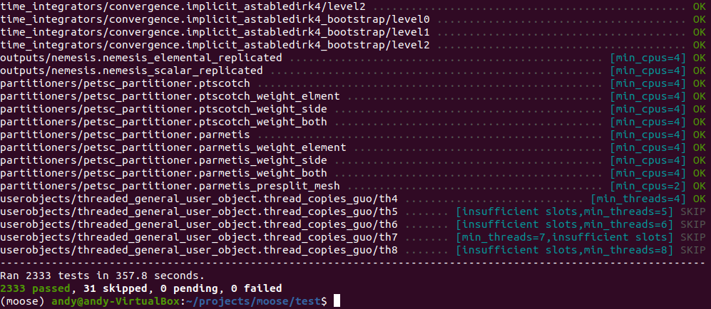

# 02 Installation

#### Machine Requirements:

GNU/Linux/MacOS Requirements:
  * GCC/Clang C++11 compiler (GCC > 4.8.4, or Clang > 3.5.1)
  * Memory (> 8 GB)
  * Processor (64bit x86)
  * Disk (> 30GB)

#### Setup:

#####  1. We first need to install Miniconda/Anaconda

*Note: If Anaconda is installed, please moved to step 3*

Linux:

    curl -L -O https://repo.anaconda.com/miniconda/Miniconda3-latest-Linux-x86_64.sh bash Miniconda3 latest-Linux-x86_64.sh -b -p ~/miniconda3

MacOS:

    curl -L -O https://repo.anaconda.com/miniconda/Miniconda3-latest-MacOSX-x86_64.sh bash Miniconda3-latest-MacOSX-x86_64.sh -b -p ~/miniconda3

##### 2. Append the following line to the PATH parameters:

    export PATH=$HOME/miniconda3/bin:$PATH

##### 3. Add the MOOSE library channel to Miniconda:

    conda config --add channels conda-forge
    conda config --add channels https://mooseframework.org/conda/moose

##### 4. Let create a isolate environment which contains all MOOSE configs, and activate it

    conda create --name moose moose-libmesh moose-tools
    conda activate moose

#### Installation:

MOOSE can be installed on both personal machines and HPC.

To start, let clone MOOSE from Github by making a directory named `projects` and put MOOSE inside it

    mkdir ~/projects
    cd ~/projects
    git clone https://github.com/idaholab/moose.git
    cd moose
    git checkout master

Afterward, we can compile and test MOOSE

    cd ~/projects/moose/test
    make -j 4
    ./run_tests -j 4

The result will contain many test (hopefully all of them will pass). An example of successful install is shown below:

