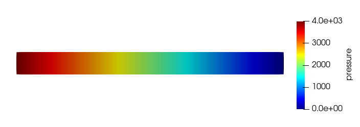

# 03 Workflow

Typically Workflow of MOOSE are as follow:

1. Pre-processing
2. Setup Physics(Governing Equations)
3. Construct or apply objects from MOOSE
3. Post processing

# Pre-processing

During this step, the goal is to construct the suitable geometries. MOOSE accepts a variety of inputs geometry files from various applications (Exodus from Sandia, ANSYS, ACIS), Exodus serves the most support files type in using MOOSE

# Setup Physics

In this step, we can setup the simplest inputs file for MOOSE to get running. Every MOOSE inputs file typically contains the following:

##### [Mesh] - Define geometry

    [Mesh]
      type = GeneratedMesh # Can generate simple lines, rectangles and rectangular prisms
      dim = 2              # Dimension of the mesh
      nx = 100             # Number of elements in the x direction
      ny = 10              # Number of elements in the y direction
      xmax = 0.304         # Length of test chamber
      ymax = 0.0257        # Test chamber radius
    []

##### [Variables] - Define unknowns

    [Variables]
      [pressure]
        # Adds a Linear Lagrange variable by default
      []
    []

##### [Kernels] - Define the Equations

    [Kernels]
      [diffusion]
        type = ADDiffusion  # Laplacian operator using automatic differentiation
        variable = pressure # Operate on the "pressure" variable from above
      []
    []

##### [BCs] - Define boundary conditions(s)\

    [BCs]
      [inlet]
        type = DirichletBC  # Simple u=value BC
        variable = pressure # Variable to be set
        boundary = left     # Name of a sideset in the mesh
        value = 4000        # (Pa) From Figure 2 from paper.  First data point for 1mm spheres.
      []
      [outlet]
        type = DirichletBC
        variable = pressure
        boundary = right
        value = 0           # (Pa) Gives the correct pressure drop from Figure 2 for 1mm spheres
      []
    []

##### [Executioner] - Define solver

    [Executioner]
      type = Steady       # Steady state problem
      solve_type = NEWTON # Perform a Newton solve, uses AD to compute Jacobian terms
    []

##### [Outputs] - Define outputs format/Variables

    [Outputs]
      exodus = true # Output Exodus format
    []

---
# Let Run the file

To run the following inputs file serially:

    ~/projects/moose/test/moose_test-opt -i 03_inputs.i

Or use Peacock(MOOSE GUI) to visualize the outputs as well:

    ~/projects/moose/python/peacock/peacock -i 03.input.i

For large simulations, MPI can be applied to increase the speed:

    mpiexec -n <n_threads> ~/projects/moose/test/moose_test-opt -i 03_inputs.i

---
# Visualization

One can use any visualization software (or Peacock), but the most common to visualize MOOSE outputs file is using Sandia [Paraview](https://www.paraview.org/).

Peacock

    ~/projects/moose/python/peacock/peacock -r 03_input_out.e

Paraview

    paraview 03_input_out.e

The output should be as follow:

