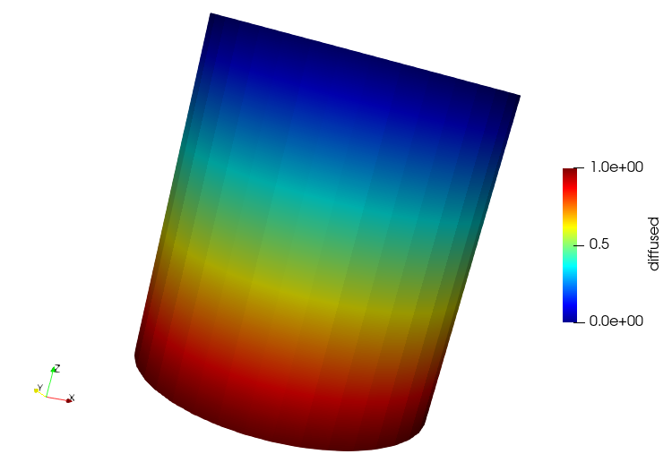
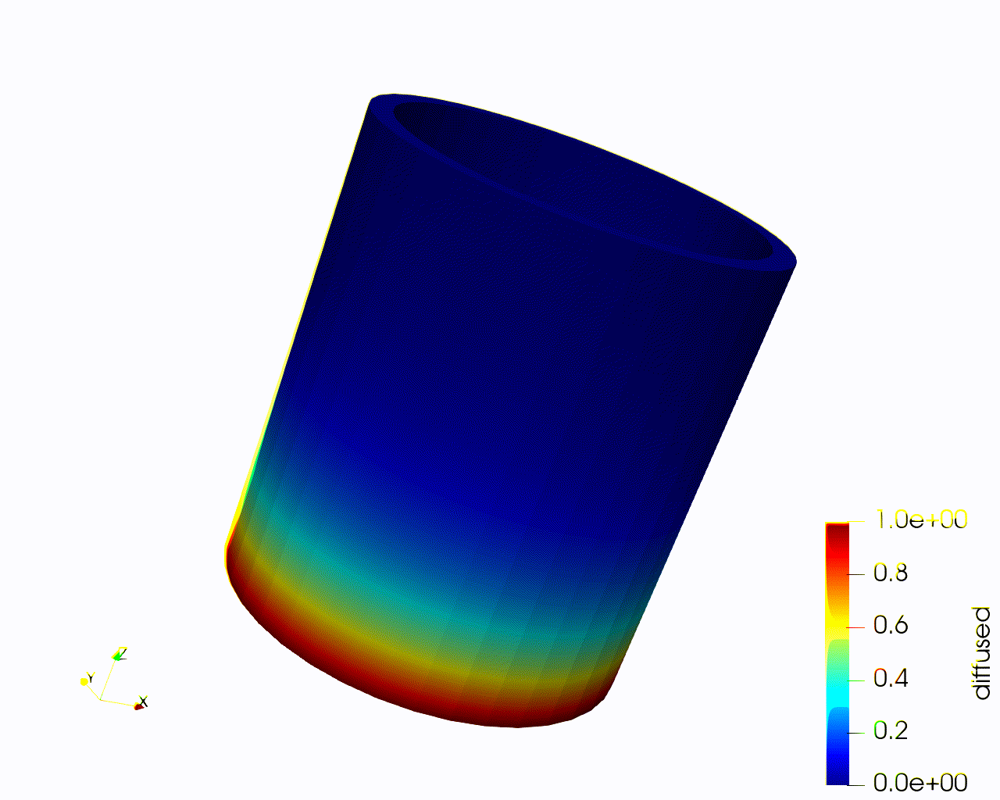

# 04 Usage

Now that we have done a simple MOOSE process, let dive into the Inputs files for each sections:

### Mesh

One can use all suitable MOOSE mesh type or use the internal `GenerateMesh` to generate a simple geometry.

######  FileMesh

    [Mesh]
      file = sample.msh # One type of inputs files working
      dim = 3
    []

######  GeneratedMesh

    [Mesh]
      type = GeneratedMesh
      dim = 2
      xmin = -1
      xmax = 1
      ymin = -1
      ymax = 1
      nx = 2
      ny = 2
      elem_type = QUAD9
    []

The block above generates a simple 2-D geometry with 4 elements.

### Materials

MOOSE uses the material system to define material properties and allows for variables coupling. The role of material system is to generate properties which will be used by other MOOSE objects.

    [Materials]
      [block_1]
        type = OutputTestMaterial
        block = 1
        output_properties = 'real_property tensor_property'
        outputs = exodus
        variable = u
      []
      [block_2]
        type = OutputTestMaterial
        block = 2
        output_properties = 'vector_property tensor_property'
        outputs = exodus
        variable = u
      []
    []

The `block_1` performs on block 1 and operates on variable `u`, while `block_2` performs on block 2 and operates on the same variable `u`.

#### Variables

In variables block, each variables represents a unknown in the equations. Each variables can be define with orders and shape functions, as well as initial values.

    [Variables]
      [./diffused]
        order = FIRST
        family = LAGRANGE
      [../]
    []

The variable above is name `diffused` which is first order and lagrange family.

#### [Kernels]

Each variables must associate with at least one Kernels, which represents the equations to solve:
For our case, `u` presents the pressure kernels and therefore we can apply a diffusion kernels:

    [./diff]
      type = Diffusion
      variable = diffused
    [../]

The above kernels is use for a steady state diffusion, define as:

#### [BCs]

We have to supply additional information to our problem in-order for it to be solvable. Typically this comes in the forms of BCs. BCs comes a variety of forms such as `DirichletBC`, `NeumannBC` and more.

    [BCs]
      [./bottom] # arbitrary user-chosen name
        type = DirichletBC
        variable = diffused
        boundary = 'bottom' # This must match a named boundary in the mesh file
        value = 1
      [../]

      [./top] # arbitrary user-chosen name
        type = DirichletBC
        variable = diffused
        boundary = 'top' # This must match a named boundary in the mesh file
        value = 0
      [../]
    []

In the sample input file, we applied DirichletBC on both top and bottom to create a gradient.

#### [Executioner]

Executioner block dictates the method we will be using to solve. There are typically two types of executioner: `Steady` or `Transient`. Secondary, we can choose the `solver_type`, i.e. `Newton`, `PFJNK`, `FD`, `Linear`. For `Transient`, we also must states end conditions such as `dt`, or `num_steps`. We will be using a steady state solver with Newton solver.

    [Executioner]
      type = Steady
      solve_type = 'Newton'
    []

The result should be as follow:

 However, we want to obseve our simulations varies in time, and therefore we have to use the `Transient` solver which calculates the residual at every time steps. To change our code to transient, we have to included a new kernel block for time derivative.

     [Kernels]
       [./diff]
         type = Diffusion
         variable = diffused
       [../]
       [./time]
         type = TimeDerivative
         variable = diffused
       [../]
     []

In additions, we also change our executioner to transient and added termination conditions.

    [Executioner]
      type = Transient
      solve_type = 'Newton'
      num_steps = 20
      dt = 1
    []

The result should be as such:

 
