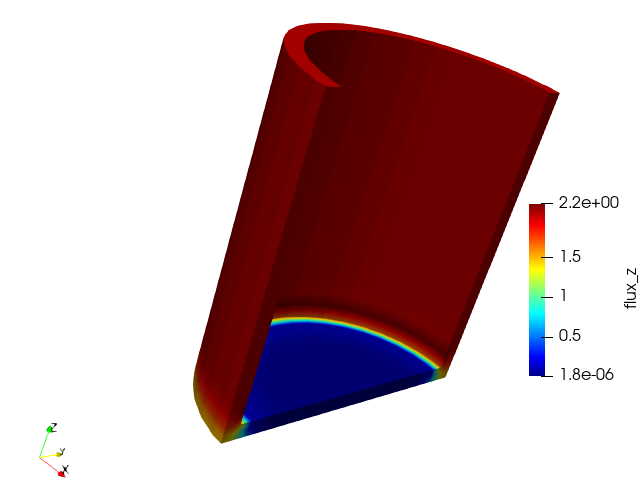

# 05 Auxillery Systems

Now we can run MOOSE, but often times in science we need more meaningful result or more fine control to the problem statement than just solving for "core" variables. MOOSE has ways of handling such with the use of `AuxVariables` and `AuxKernels`. These serves to perform calculations on top of `Variables` and `Kernels` block, perform modifications with respects to non-linear variables.

For example, we want to compute the flux of the diffusion equation, and a AuxVar/Kernels combinations is the perfect way. The flux is represented using the following:

where J is the flux, D is the diffusivity, and c is the concentration. We will first create the aux-variable as follow:

    [AuxVariables]
      [./flux_z]
        order = FIRST  # <- Order
        family = MONOMIAL # <- Monomial makes the sure the values stay monotonic.
      []
    []

However, we need to perform the computations above, and we will use `DiffusionFluxAux`, which we will select to calculate the z component.

    [AuxKernels]
      [./flux_z]
        type = DiffusionFluxAux
        diffusivity = 'thermal_conductivity'
        variable = flux_z
        diffusion_variable = diffused
        component = z
      [../]
    []

Lastly, we need to state the `thermal_conductivity` in the Material Block:

    [Materials]
      [./k]
        type = GenericConstantMaterial
        prop_names = 'thermal_conductivity'
        prop_values = '10' # in W/mK
      []
    []

We can then visualize our z-flux component in our output file after running.

