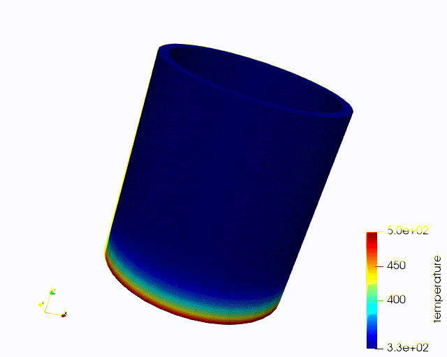

# 06 Modules

MOOSE contains a variety of preexists module which contains different physics. This includes **Heat conduction**. We will explore some of these modules in the following:

## Heat conduction

One of the common equations to solve is the heat conduction equations:

where C is the conductivity, and k is thermal conductivity.

We make the following changes to the inputs files:

For `Variables`, we added initial conditions to stated the starting value

    [Variables]
      [./temperature]
        order = FIRST
        family = LAGRANGE
        initial_condition = 330 # Start at room temperature
      [../]
    []

For `Kernels`, we added two kernels to solve the heat conduction equations above. One of the kernels is for solving the heat conduction spatially while the other is for temporal changes.

    [Kernels]
      [./heat_conduction]
        type = HeatConduction
        variable = temperature
      []
      [./heat_conduction_time_derivative]
        type = HeatConductionTimeDerivative
        variable = temperature
      []
    []

For `Materials`, we modified the two properties, and also added density.

    [Materials]
      [./k]
        type = GenericConstantMaterial
        prop_names = 'thermal_conductivity specific_heat density'
        prop_values = '18 0.466 8000' # W/m*K, J/kg-K, kg/m^3 @ 296K
      []
    []

For `BCs`, we made the changes to varies from 330 to 500 Kelvin.

    [BCs]
      [./bottom] # arbitrary user-chosen name
        type = DirichletBC
        variable = temperature
        boundary = 'bottom' # This must match a named boundary in the mesh file
        value = 500 # (K)
      [../]

      [./top] # arbitrary user-chosen name
        type = DirichletBC
        variable = temperature
        boundary = 'top' # This must match a named boundary in the mesh file
        value = 330 # (K)
      [../]
    []

Since our equations is not solving for steady state, we change our `Executioner` to transient.

    [Executioner]
      type = Transient
      dt = 20
      num_steps = 50
      solve_type = NEWTON
    []

The following should be our outputs

