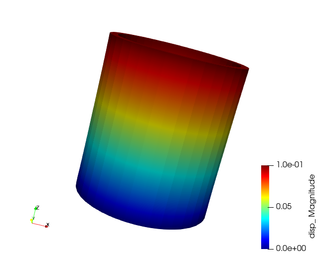

# Tensor Mechanics

### Input File : 06_Tensor.i

One common use of FEM is to solve solid mechanics problem, and `Tensor Mechanics` module provides such capability using tensor notations.

where  is the Cauchy stress tensor and *F* is the body force.

Tensor mechanics uses a modular system where the main tensor used to calculate the residual is contain in three separates material class. The 3 main tensor that must be defined are : C (elasticity tensor),  (strain or strain increment), and  (stress).

Let start a 3D simulation using Tensor Mechanics, instead of a diffusion problem, we will apply a solid mechanics problem where the object is subjected to some prescribed displacement.

In the input file, we will include the **Master Action** for the tensor mechanics, as well as labeling strain as `small`. This means we will compute only small strain.

    [Modules/TensorMechanics/Master]
      [./block1]
        strain = SMALL #Small linearized strain, automatically set to XYZ coordinates
        add_variables = true #Add the variables from the displacement string
      [../]
    []

In addition, we will also add a `GlobalParams` block to for labeling the displacements. The global parameters will be apply to all subsequent block with the matching parameters.

    [GlobalParams]
      displacements = 'disp_x disp_y disp_z'
    []

We also have to specify elasticity tensor and stress, which is done in the `Material` block. We will be using standard elasticity tensor with only 2 values (Youngs Modulus and Poisson Ratio). More symmetry options is available.

    [Materials]
      [./elasticity_tensor]
        # Standard Isotropic Elasticty Tensor
        type = ComputeIsotropicElasticityTensor
        youngs_modulus = 2.1e6 # MPa
        poissons_ratio = 0.3  
      [../]
      [./stress]
        type = ComputeLinearElasticStress # compute standard linear elastic stress
      [../]
    []

In additions, we want to change to executioner to be better suited for our problem, as well as including pre-conditioning to our problem:

    [Preconditioning]
      [./SMP]
        type = SMP
        full = true
      [../]
    []

    [Executioner]
      type = Steady # Steady State
      solve_type = 'NEWTON' # NEWTON METHOD Solver
      petsc_options = '-snes_ksp_ew'
      petsc_options_iname = '-pc_type -sub_pc_type -pc_asm_overlap -ksp_gmres_restart'
      petsc_options_value = 'asm lu 1 101'

      nl_rel_tol = 5e-9
      nl_abs_tol = 1e-10
      nl_max_its = 15

      l_tol = 1e-3
      l_max_its = 50
    []

Running `06_Tensor.i` gives us a `disp` variable in the result:

However, visualizing displacement is usually not useful since we are usually more interested in other properties such as axial stress or effective strain, which are some scalar computations of the tensor itself. Therefore we will make use of MOOSE auxillery system. To calculate some scalar components, we will use `RankTwoScalarAux ` and calculate the Axial Stress in the z direction.

    [AuxVariables]
      [./Axial_Stress]
        order = FIRST
        family = MONOMIAL
      []
    []

    [AuxKernels]
      [./Axial]
        type = RankTwoScalarAux
        rank_two_tensor = stress
        variable = Axial_Stress # Refernces the corresponding AuxVariables
        scalar_type = AxialStress
      [../]
    []

Running `06_Tensor_aux.i` gives us new variable call `Aux_Stress` in the result:

